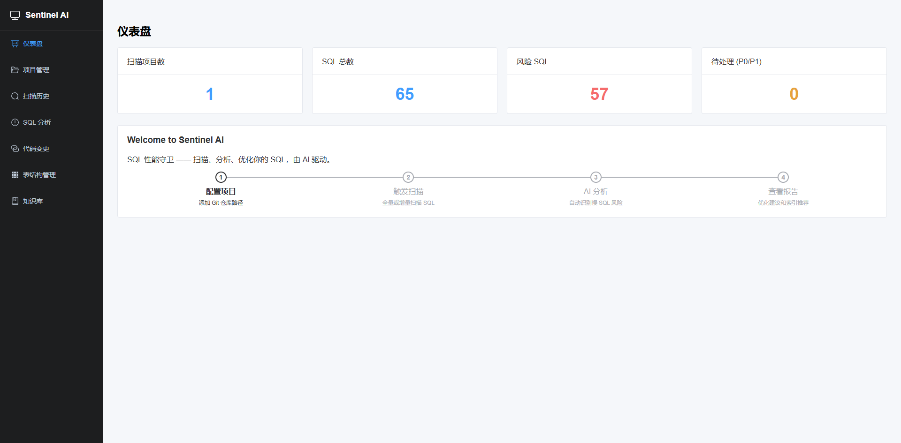
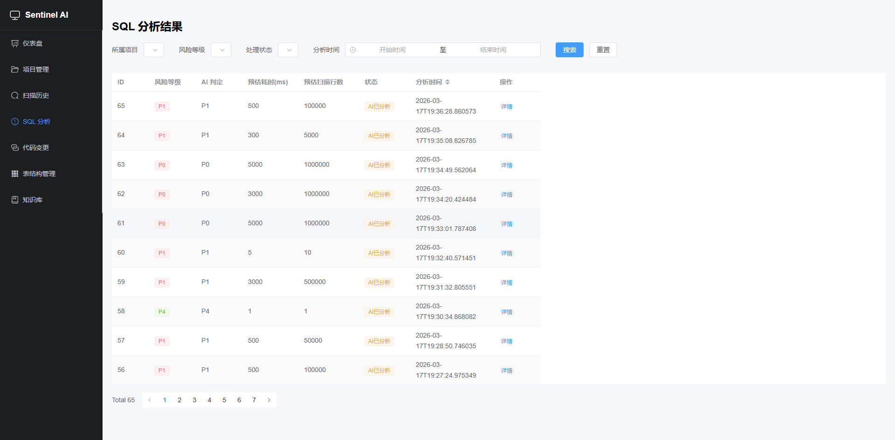
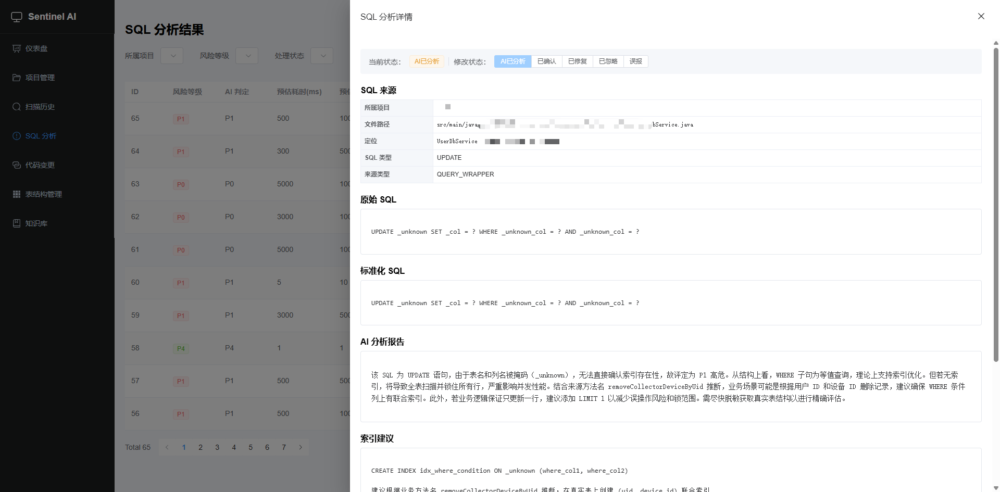
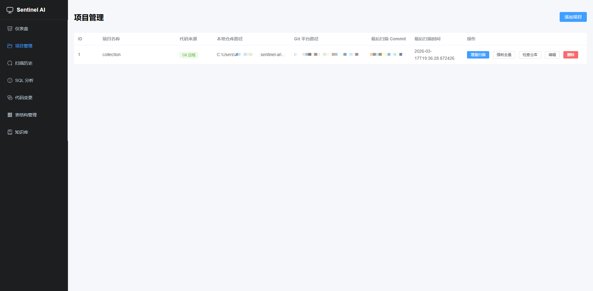
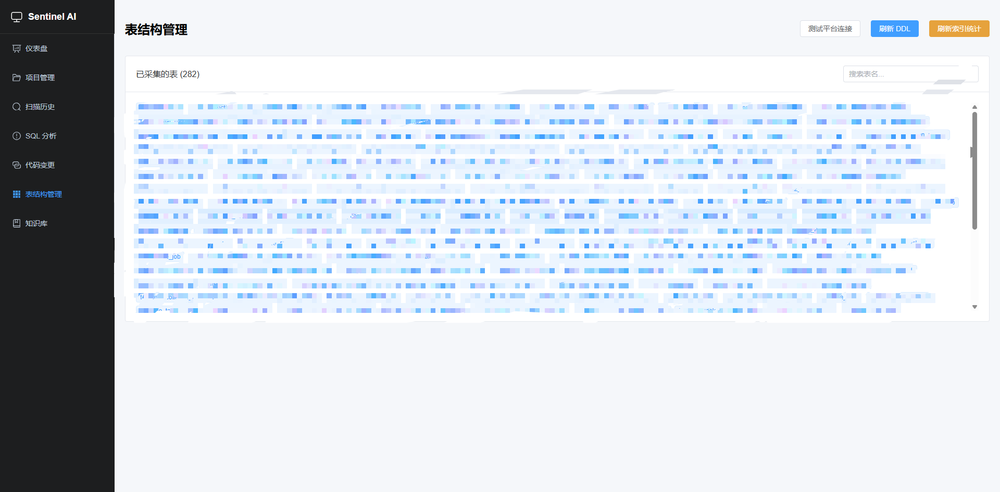
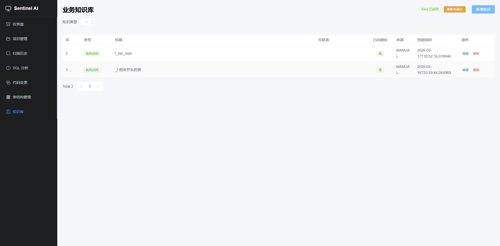
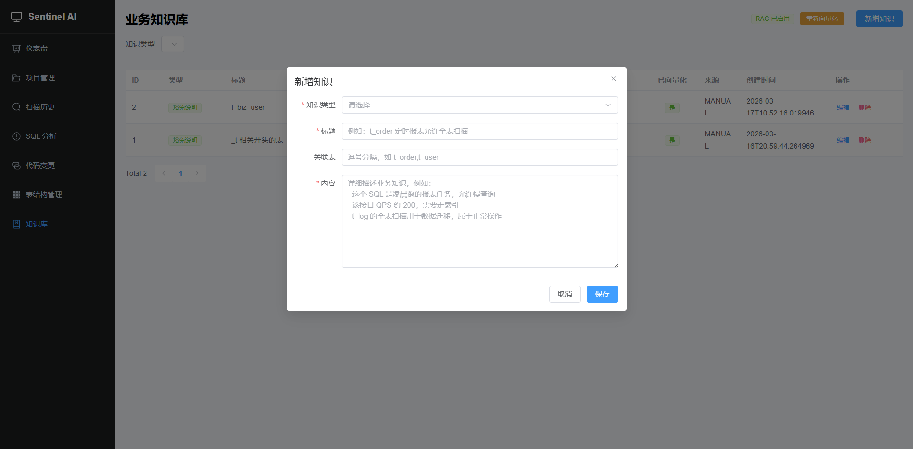

# Sentinel AI

> SQL 性能哨兵 —— 扫描 Java 项目中的全量 SQL，结合**生产环境真实表结构、索引区分度、数据量**，由 AI 精准判断是否走索引、是否为潜在慢 SQL，并给出可执行的优化建议。

---

## 为什么需要 Sentinel AI？

传统的 SQL 审查往往依赖 DBA 经验或静态规则，难以覆盖以下场景：

- **代码中的 SQL 散落各处** —— Mapper XML、`@Select` 注解、`QueryWrapper` 链式调用……手工排查效率极低
- **脱离真实数据谈优化是空谈** —— 一张 100 行的表全表扫描无所谓，一张 5000 万行的表缺一个索引就是线上事故
- **索引加了不等于有效** —— 区分度只有 0.01 的索引形同虚设，需要结合 Cardinality 和 Selectivity 才能判断

Sentinel AI 的核心理念：**用生产级元数据武装 AI，让每一条 SQL 分析都有据可依。**

---

## 界面预览

### 仪表盘



### SQL 分析列表



### SQL 分析详情



### 项目管理



### 表结构管理



### 知识库（RAG）




---

## 核心特性

### 🔍 全量 SQL 自动提取

从 Java 项目源码中自动提取所有 SQL，覆盖三大来源：

| 来源 | 技术 | 示例 |
|---|---|---|
| MyBatis Mapper XML | JSqlParser 解析 | `<select>`、`<insert>`、动态 `<if>`/`<choose>` |
| 注解 SQL | JavaParser AST | `@Select("SELECT ...")`、`@Update(...)` |
| QueryWrapper | JavaParser AST | `new LambdaQueryWrapper<>().eq(...)` |

支持动态 SQL 展开（`<if>`/`<choose>`/`<where>`/`<foreach>` 等所有 MyBatis 动态标签），生成多条执行路径分别分析。

### 📊 生产环境实时元数据

不是猜测，而是用**真实的生产数据**做分析依据：

- **表结构 DDL** —— `SHOW CREATE TABLE` 完整输出，含所有索引定义
- **数据量** —— 每张表的估算行数（`INFORMATION_SCHEMA.TABLES`）
- **索引区分度** —— 每个索引的 Cardinality、Selectivity、唯一性等统计信息

```sql
-- 示例：table-meta/t_action_result.sql
-- Estimated Rows: 188

CREATE TABLE `t_action_result` (
  `id` bigint(20) NOT NULL AUTO_INCREMENT,
  ...
  PRIMARY KEY (`id`),
  UNIQUE KEY `uni_serial_no` (`serial_no`),
  KEY `idx_update_time` (`update_time`)
) ENGINE=InnoDB ...

-- === Index Statistics (auto-collected) ===
-- Table Rows: 188
-- Index: idx_update_time | Columns: update_time | Cardinality: 84 | Selectivity: 0.4468
-- Index: PRIMARY | Columns: id | Cardinality: 188 | Selectivity: 1.0000
```

这些元数据会被注入到 AI 的 Prompt 中，让 AI 做出有数据支撑的判断。

### 🤖 AI 驱动的深度分析

每条 SQL 由大模型（通义千问 Qwen）逐一分析，输出结构化报告：

- **风险等级** —— P0（紧急）/ P1（高危）/ P2（中危）/ P3（低危）/ P4（安全）
- **索引命中判断** —— 是否走索引、走哪个索引
- **性能估算** —— 预估扫描行数、执行时间
- **问题清单** —— 全表扫描、LIKE 前导通配符、隐式类型转换、深分页……
- **索引建议** —— 直接给出 `CREATE INDEX` 语句
- **SQL 改写建议** —— 给出优化后的 SQL 写法

### 📚 RAG 知识库增强

内置 RAG（检索增强生成）系统，让 AI 分析融入团队积累的业务知识：

- **知识类型** —— 豁免规则、业务背景、优化经验、QPS 信息、慢查询备注
- **双重检索** —— 精确匹配（按表名）+ 语义检索（向量相似度 Top-3）
- **自动向量化** —— 知识条目创建/更新时自动生成 Embedding 并存入 PGVector
- **Prompt 注入** —— 检索结果自动注入 AI 分析 Prompt，实现上下文感知的智能分析

例如，你可以录入一条知识：「`t_case` 表的 `status` 字段只有 5 个枚举值，区分度极低，不建议单独建索引」，AI 在分析相关 SQL 时会自动参考。

### 🔀 Git 集成

支持本地项目和远程 Git 仓库两种模式：

| 模式 | 说明 |
|---|---|
| **本地路径** | 直接指定本地 Git 仓库路径，适用于已 clone 的项目 |
| **远程拉取** | 填写 Git 远程 URL，系统自动 Clone/Pull 到本地 |

- 支持 **GitLab**（自建/SaaS）和 **GitHub**
- 基于 JGit 的增量扫描 —— 只分析两次 commit 之间变更的 SQL，避免全量重复分析
- 代码变更可视化页面 —— 查看分支列表、提交历史、文件 diff

---

## 技术栈

| 层面 | 技术 | 版本 |
|---|---|---|
| 语言 | Java | 21 |
| 后端框架 | Spring Boot | 3.4.3 |
| AI 模型 | 通义千问（Qwen3.5-Plus / Qwen-Plus / Qwen-Max） | — |
| AI SDK | DashScope SDK（MultiModalConversation + TextEmbedding） | 2.22.7 |
| RAG | Spring AI + PGVector（1024 维，HNSW 索引，余弦距离） | 1.0.0 |
| 数据库 | PostgreSQL + pgvector 扩展 | PG 16+ |
| ORM | MyBatis-Plus | 3.5.7 |
| SQL 解析 | JSqlParser | 5.0 |
| Java AST | JavaParser | 3.26.2 |
| Git 操作 | JGit | 7.1.0 |
| 缓存 | Caffeine | 3.1.8 |
| 前端 | Vue 3 + TypeScript + Element Plus + Vite | Vue 3.5, Vite 6 |
| 构建 | Maven 多模块 | — |

---

## 项目结构

```
sentinel-ai/
├── pom.xml                          # 父 POM
├── docker-compose.yml               # PostgreSQL + pgvector 容器
├── table-meta/                      # 表结构 DDL 文件（每张表一个 .sql 文件）
│   ├── t_case.sql
│   ├── t_case_cf.sql
│   └── ...
├── sentinel-ai-server/              # Spring Boot 后端
│   ├── pom.xml
│   └── src/main/java/com/zhuangjie/sentinel/
│       ├── SentinelAiApplication.java
│       ├── config/                  # 配置（AI、缓存、MyBatis-Plus、Web）
│       ├── controller/              # REST API 控制器
│       ├── service/                 # 业务逻辑编排
│       ├── scanner/                 # SQL 提取引擎
│       │   ├── MapperXmlScanner     #   Mapper XML 解析
│       │   ├── AnnotationSqlScanner #   @Select/@Insert 注解扫描
│       │   ├── QueryWrapperScanner  #   QueryWrapper/LambdaQueryWrapper AST 分析
│       │   ├── DynamicSqlExpander   #   动态 SQL 展开
│       │   └── SqlNormalizer        #   SQL 标准化 + SHA-256 哈希
│       ├── analyzer/                # AI 分析引擎
│       │   └── AiSqlAnalyzer        #   DashScope API 调用（注入 DDL + RAG）
│       ├── delta/                   # Git 增量检测
│       │   ├── GitDeltaDetector     #   JGit diff 检测
│       │   ├── GitRepoManager       #   Clone / Pull 管理
│       │   └── SqlHashComparator    #   SQL 变更对比
│       ├── git/                     # Git 平台 API 集成
│       │   ├── GitLabClient         #   GitLab REST API v4
│       │   └── GitHubClient         #   GitHub REST API
│       ├── knowledge/               # 表结构知识库
│       │   ├── DdlExporter          #   独立工具：从 MySQL 拉取 DDL
│       │   ├── KnowledgeContextBuilder  #   构建 AI Prompt 上下文
│       │   └── TableNameExtractor   #   JSqlParser 提取表名
│       ├── rag/                     # RAG 业务知识库
│       │   ├── DashScopeEmbeddingModel  #   DashScope Embedding 适配器
│       │   ├── KnowledgeRagService  #   知识 CRUD + 向量化 + 检索
│       │   └── RagConfig            #   PGVector 基础设施配置
│       └── db/                      # 数据访问层（entity / mapper / service）
└── sentinel-ai-ui/                  # Vue 3 前端
    ├── package.json
    ├── vite.config.ts
    └── src/
        ├── App.vue                  # 侧边栏导航布局
        ├── api/index.ts             # API 定义
        ├── router/index.ts          # 路由配置
        └── views/
            ├── Dashboard.vue        # 仪表盘
            ├── Projects.vue         # 项目管理
            ├── Scans.vue            # 扫描历史
            ├── Analysis.vue         # SQL 分析结果
            ├── GitIntegration.vue   # 代码变更可视化
            ├── TableMeta.vue        # 表结构管理
            └── Knowledge.vue        # 知识库管理
```

---

## 快速开始

### 环境要求

| 依赖 | 版本要求 | 说明 |
|---|---|---|
| JDK | 21+ | 推荐 Eclipse Temurin |
| Maven | 3.8+ | 后端构建 |
| Node.js | 18+ | 前端构建 |
| PostgreSQL | 16+ | 需安装 pgvector 扩展 |
| DashScope API Key | — | 通义千问 API，[申请地址](https://dashscope.console.aliyun.com/) |

### 1. 启动数据库

**方式 A：Docker（推荐）**

```bash
docker compose up -d
```

这将启动一个包含 pgvector 扩展的 PostgreSQL 实例（端口 5432，数据库 `sentinel_ai`）。

**方式 B：本地安装**

安装 PostgreSQL 16+ 并手动安装 [pgvector](https://github.com/pgvector/pgvector) 扩展，然后创建数据库：

```bash
createdb sentinel_ai
```

### 2. 初始化数据库表

```bash
psql -U postgres -d sentinel_ai -f sentinel-ai-server/src/main/resources/db/schema-pg.sql
```

### 3. 配置后端

复制示例配置文件并填入实际值：

```bash
cp sentinel-ai-server/src/main/resources/application-dev.yml.example \
   sentinel-ai-server/src/main/resources/application-dev.yml
```

编辑 `application-dev.yml`，至少需要配置：

```yaml
spring:
  datasource:
    url: jdbc:postgresql://localhost:5432/sentinel_ai
    username: postgres
    password: <你的数据库密码>      # Docker 方式默认为 sentinel123

sentinel:
  ai:
    enabled: true
    model: qwen3.5-plus              # 可选: qwen-plus, qwen-max
    api-key: <你的 DashScope API Key>
  knowledge:
    table-meta-dir: table-meta       # 表结构 DDL 文件目录
  rag:
    enabled: true                    # 启用 RAG 知识库（需要 pgvector）
```

**可选配置：**

```yaml
sentinel:
  git:
    platform: GITLAB                 # NONE / GITLAB / GITHUB
    api-url: https://gitlab.example.com
    access-token: <Personal Access Token>
    clone-base-dir: ${user.home}/.sentinel-ai/repos

  data-platform:
    enabled: false                   # 是否对接远程数据平台自动拉取 DDL
    # 如果不对接，手动将 DDL 文件放入 table-meta/ 目录即可

  dev:
    max-sql-per-scan: 50             # 开发调试用，限制单次扫描 SQL 数量（-1 不限）
  ai:
    max-ai-calls-per-scan: 50        # 开发调试用，限制单次 AI 调用次数（-1 不限）
```

### 4. 启动后端

```bash
# 设置 JAVA_HOME（如果需要）
export JAVA_HOME=/path/to/jdk-21

# 编译并启动
cd sentinel-ai
mvn compile -pl sentinel-ai-server
mvn spring-boot:run -pl sentinel-ai-server -Dspring-boot.run.profiles=dev
```

后端启动在 `http://localhost:8090`。

### 5. 启动前端

```bash
cd sentinel-ai-ui
npm install
npm run dev
```

前端启动在 `http://localhost:5173`，API 请求自动代理到后端 8090 端口。

### 6. 构建生产版本（可选）

前端构建产物会输出到后端的 `static` 目录，由 Spring Boot 直接提供服务：

```bash
cd sentinel-ai-ui
npm run build
```

然后只需启动后端即可同时提供 API 和前端页面。

---

## 使用流程

### Step 1 — 添加项目

在「项目管理」页面添加你要扫描的 Java 项目：

- **本地路径模式** —— 填写本地 Git 仓库的绝对路径
- **远程拉取模式** —— 填写 Git 远程 URL，系统自动 Clone 到本地


### Step 2 — 准备表结构元数据

AI 分析的精准度高度依赖表结构信息。提供表结构有两种方式：

**方式 A：手动维护（推荐起步方式）**

将 `SHOW CREATE TABLE` 的输出保存到 `table-meta/` 目录，每张表一个 `.sql` 文件：

```sql
-- Estimated Rows: 50000

CREATE TABLE `t_your_table` (
  `id` bigint NOT NULL AUTO_INCREMENT,
  ...
  PRIMARY KEY (`id`),
  KEY `idx_xxx` (`column_a`, `column_b`)
) ENGINE=InnoDB ...
```

**方式 B：命令行批量导出**

使用内置的 `DdlExporter` 工具从 MySQL 数据库批量拉取：

```bash
mvn exec:java -pl sentinel-ai-server \
  -Dexec.mainClass=com.zhuangjie.sentinel.knowledge.DdlExporter \
  "-Dexec.args=jdbc:mysql://host:3306/db?user=xxx&password=yyy table-meta"
```

**方式 C：通过页面刷新**

如果配置了远程数据平台对接，在「表结构管理」页面点击「刷新 DDL」和「刷新索引统计」按钮即可自动更新。


### Step 3 — 触发扫描

在「扫描历史」页面选择项目并触发扫描。系统将：

1. 遍历项目源码，提取所有 SQL（XML + 注解 + QueryWrapper）
2. 标准化 SQL 并计算哈希，对比上次扫描结果，识别新增/变更/移除
3. 对每条 SQL 注入对应的表结构 DDL + 索引统计 + RAG 知识库上下文
4. 调用 AI 逐条分析，输出结构化风险报告

### Step 4 — 查看分析结果

在「SQL 分析」页面查看所有分析结果，支持按项目、风险等级、处理状态、时间范围筛选。

点击详情可查看：原始 SQL、标准化 SQL、AI 分析报告、索引建议、改写建议、关联的表结构 DDL。

可对每条分析结果标记处理状态：已确认 / 已修复 / 已忽略 / 误报。


### Step 5 — 维护知识库（可选）

在「知识库」页面录入团队沉淀的优化经验、业务背景、豁免规则等，系统会自动向量化并在后续分析中通过 RAG 检索注入。


---

## 配置参考

<details>
<summary>完整 application-dev.yml 示例</summary>

```yaml
spring:
  datasource:
    driver-class-name: org.postgresql.Driver
    url: jdbc:postgresql://localhost:5432/sentinel_ai
    username: postgres
    password: your-db-password

sentinel:
  ai:
    enabled: true                          # 启用 AI 分析
    model: qwen3.5-plus                    # AI 模型
    api-key: ${AI_DASHSCOPE_API_KEY:}      # DashScope API Key
    temperature: 0.2
    max-ai-calls-per-scan: -1              # -1 不限，开发时可设为 50
  knowledge:
    table-meta-dir: table-meta             # DDL 文件根目录
  rag:
    enabled: true                          # 启用 RAG 知识库
    embedding-model: text-embedding-v3     # Embedding 模型
  data-platform:
    enabled: false                         # 远程数据平台（可选）
  git:
    platform: NONE                         # NONE / GITLAB / GITHUB
    api-url: https://gitlab.example.com
    access-token: your-token
    clone-base-dir: ${user.home}/.sentinel-ai/repos
  dev:
    max-sql-per-scan: -1                   # -1 不限
```

</details>

| 配置项 | 说明 | 必填 | 默认值 |
|---|---|---|---|
| `sentinel.ai.enabled` | 是否启用 AI 分析 | 是 | `false` |
| `sentinel.ai.api-key` | DashScope API Key | 是 | — |
| `sentinel.ai.model` | AI 模型名称 | 否 | `qwen3.5-plus` |
| `sentinel.rag.enabled` | 是否启用 RAG 知识库 | 否 | `false` |
| `sentinel.knowledge.table-meta-dir` | DDL 文件目录 | 否 | `table-meta` |
| `sentinel.git.platform` | Git 平台类型 | 否 | `NONE` |
| `sentinel.git.access-token` | Git Personal Access Token | 否 | — |
| `sentinel.data-platform.enabled` | 是否对接远程数据平台 | 否 | `false` |

---

## API 概览

| 路径 | 说明 |
|---|---|
| `GET /api/dashboard/*` | 仪表盘统计 |
| `GET/POST /api/project/*` | 项目管理（CRUD、Clone、仓库状态检查） |
| `POST /api/scan/*` | 扫描触发 / 历史查询 |
| `GET /api/analysis/*` | 分析结果（分页、详情、状态变更） |
| `GET /api/git/*` | Git 集成（分支、提交、Diff、配置状态） |
| `GET/POST /api/table-meta/*` | 表结构管理（DDL 刷新、索引统计刷新） |
| `GET/POST /api/knowledge/*` | 知识库管理（CRUD、重新向量化、RAG 状态） |

---

## 工作原理

```
┌─────────────────────────────────────────────────────────────────┐
│                        Java 项目源码                              │
│   Mapper XML  ·  @Select 注解  ·  QueryWrapper/LambdaWrapper     │
└────────────┬────────────────────────────────────────────────────┘
             │  Scanner（JSqlParser + JavaParser）
             ▼
┌─────────────────────────────────────────────────────────────────┐
│                   SQL 标准化 + 去重（SHA-256）                     │
│              Git 增量对比（JGit），识别新增/变更 SQL                  │
└────────────┬────────────────────────────────────────────────────┘
             │
             ▼
┌─────────────────────────────────────────────────────────────────┐
│                      AI 分析 Prompt 构建                          │
│                                                                   │
│   SQL 文本 + 表结构 DDL + 索引区分度 + RAG 业务知识                  │
│   ─────────────────────────────────────────────────               │
│   table-meta/          →  DDL + 数据量 + 索引统计                  │
│   PGVector 语义检索     →  业务知识 / 豁免规则 / 优化经验             │
└────────────┬────────────────────────────────────────────────────┘
             │  DashScope API（通义千问）
             ▼
┌─────────────────────────────────────────────────────────────────┐
│                   结构化风险报告                                    │
│                                                                   │
│   风险等级 · 索引命中 · 扫描行数估算 · 问题清单                       │
│   索引建议（CREATE INDEX ...）· SQL 改写建议                        │
└─────────────────────────────────────────────────────────────────┘
```

---

## 许可证

MIT License

---

## 作者

**庄杰** (Zhuang Jie) — [GitHub](https://github.com/prove0603/sentinel-ai)
